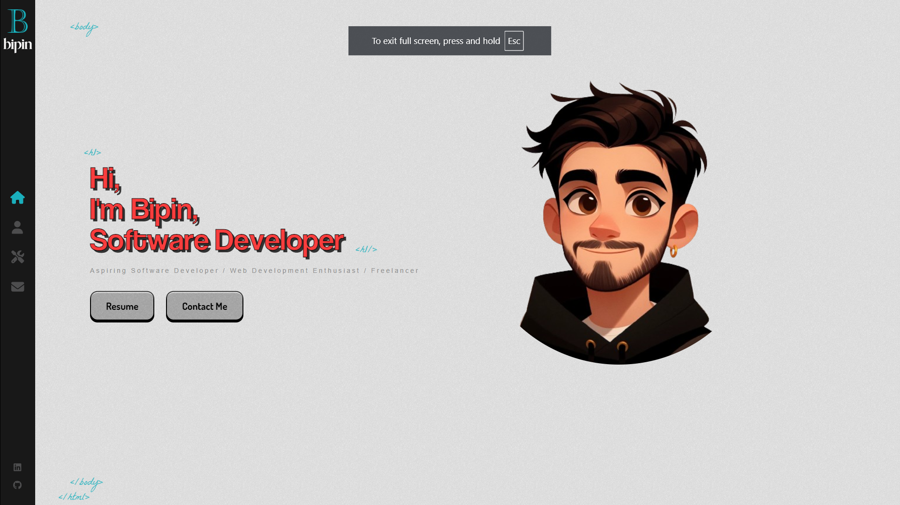

# Bipin Kalakheti's Portfolio

[](https://bipinkalakheti.github.io/Portfolio)
[](https://github.com/Bipin-Kalakheti/Portfolio/stargazers)

Welcome to my personal portfolio website! This project showcases my skills, projects, and experience as a web developer.

## 🎯 Preview



[Live Demo](https://bipinkalakheti.github.io/Portfolio)

## Table of Contents

- About
- Features
- Technologies Used
- Installation
- Usage
- Project Structure
- Contact
- License

## About

This portfolio website is a comprehensive showcase of my work as a web developer. It includes sections for my projects, skills, resume, and contact information. The site is designed to be user-friendly and visually engaging, providing visitors with a clear understanding of my capabilities and experience.

## ✨ Features

- 🎨 Modern and clean design
- 📱 Fully responsive layout
- ⚡ Smooth animations and transitions
- 📂 Detailed project showcase
- 📊 Interactive skills visualization
- 📬 Functional contact form
- 📄 Downloadable resume

## Technologies Used

- **React**: A JavaScript library for building user interfaces.
- **Sass**: A CSS preprocessor for writing cleaner and more maintainable styles.
- **FontAwesome**: Icon library for adding vector icons and social logos.
- **EmailJS**: A service for sending emails directly from the client-side.
- **React Router**: A library for routing in React applications.

## 🚀 Quick Start

1. **Clone and install**

   ```sh
   git clone https://github.com/Bipin-Kalakheti/Portfolio.git
   cd Portfolio
   npm install
   ```

2. **Set up environment variables**

   ```sh
   cp .env.example .env
   # Edit .env with your EmailJS credentials
   ```

3. **Start development server**

   ```sh
   npm start
   ```

4. Open your browser and navigate to `http://localhost:3000` to view the website.

## Usage

- **Home Page**: Introduction and links to resume and contact page.
- **About Page**: Information about me, my background, and my skills.
- **Works Page**: A showcase of my projects with descriptions, tools used, and links to live demos and source code.
- **Contact Page**: A form for visitors to send me messages and my contact information.

## Project Structure

```
.gitignore
.prettierrc
build/
public/
src/
  assets/
    CV/
    fonts/
    images/
  common/
    ProjectCard.jsx
  components/
    About/
    AnimatedLetters/
    AnimatedRoutes/
    Contact/
    Home/
    Icons/
    Layout/
    Loader/
    Works/
  App.js
  App.scss
  App.test.js
  index.css
  index.js
  reportWebVitals.js
  setupTests.js
package.json
README.md
```

## 🛠️ Development

### Prerequisites

- Node.js >= 14.x
- npm >= 6.x

### Code Style

This project uses Prettier for code formatting. Run:

```sh
npm run format
```

## 🙏 Acknowledgments

- [React](https://reactjs.org/)
- [EmailJS](https://www.emailjs.com/)
- [Font Awesome](https://fontawesome.com/)
- All my supporters and mentors

##🌐 Deployment

The site is deployed using GitHub Pages. You can visit it at: https://bipinkalakheti.github.io/Portfolio

## Contact

If you have any questions or would like to get in touch, feel free to contact me:

- **Email**: bipinkalakheti7@gmail.com
- **LinkedIn**: [Bipin Kalakheti](https://www.linkedin.com/in/bipin-kalakheti/)
- **GitHub**: [Bipin-Kalakheti](https://github.com/Bipin-Kalakheti)
